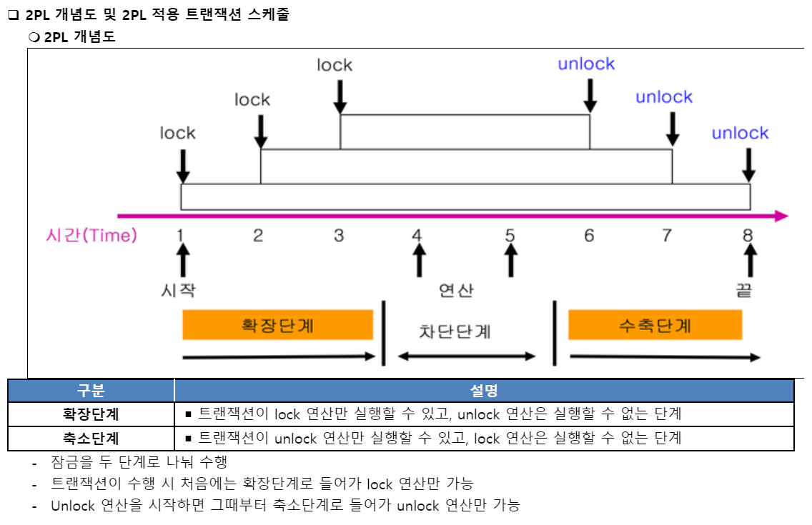
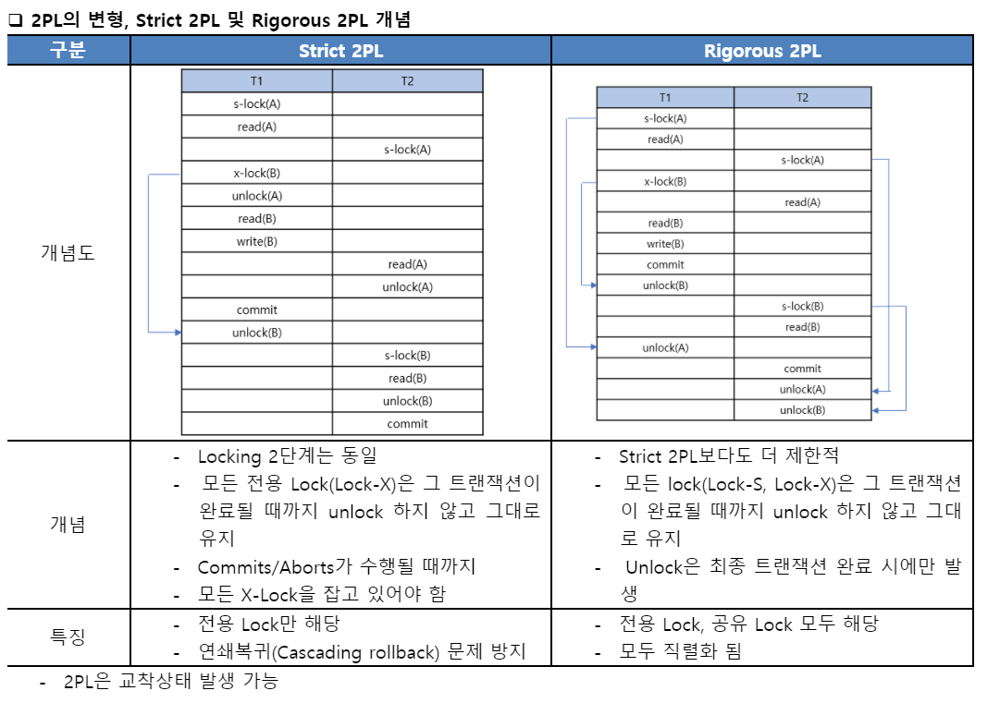
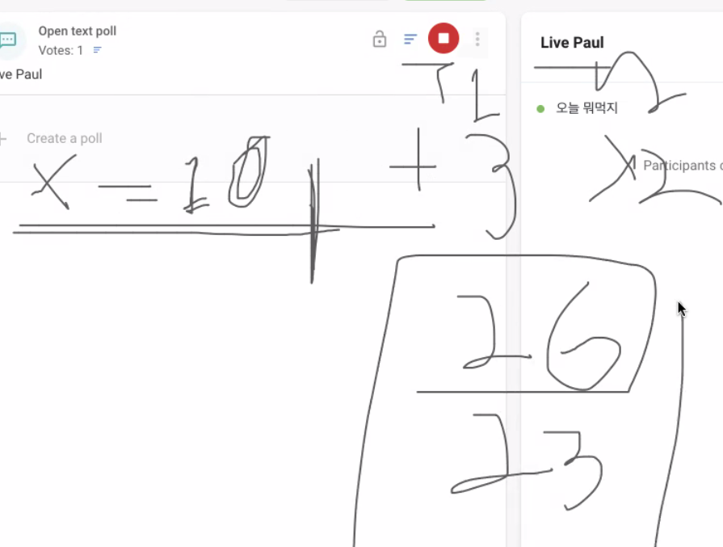

# 0527 호눅스 강의

## 세계 최초의 데이터베이스는 두개가 있다

- 동시에 나와서 판별하기 어려워서 2개인데
  - 1) 버클리 대학: postgres
  - 2) IBM : System-R
    - 짐 그레이 : 세계 최초 관계형DB를 `구현`한 사람
- `관계형 모델` 이론을 처음 발명(발견)해본 사람은 에드거 F. 커드
  - IBM에서 일하는 동안 데이터베이스 관리를 위한 관계형 모델을 만들었다
  - [커드의 12규칙](https://ko.wikipedia.org/wiki/%EC%BB%A4%EB%93%9C%EC%9D%98_12_%EA%B7%9C%EC%B9%99)
  - [데이터베이스의 정규화](https://ko.wikipedia.org/wiki/%EB%8D%B0%EC%9D%B4%ED%84%B0%EB%B2%A0%EC%9D%B4%EC%8A%A4_%EC%A0%95%EA%B7%9C%ED%99%94)
- 왜 아직도 RDB 써야하나요
  - NoSQL을 못써서인데, 트랜잭션 기능을 지원하지 않기 때문

## **Jim Gray (1944-2007)**

- 세계 최초의 관계형 데이터베이스 System-R 개발
- 트랜잭션 개념 제안
- 튜링상과 찰스배비지상 수상

## Jim Gray께서 고안한 두가지 개념
  
- Granularity Locking
- 2 Phase Locking

### 2 Phase Locking (2PL)

- 기본 로킹 규약의 문제를 해결하고 트랜잭션의 직렬 기능성을 보장하기 위해 LOCK와 UNLOCK 연산의 수행 시점에 새로 할일을 추가한 기법
  - 
  - 

### Granularity Locking (단위 잠금)

- Multiple Granularity Locking 여러 단계로 잠금 정도를 지정가능
  - 데이터베이스는 락을 테이블에만 걸 수 있는게 아님 다른 여러가지 등급(범위)로 락을 걸 수 있음
  - 테이블에다가 락을 건다고하면
    - 그 테이블에 접근하는 사람이 한번에 한 유저만 접근할 수 있으므로, 성능에 하락이 생김
  - 따라서, 테이블보다 작은 단위에 락을 걸어야하며 가능한 시나리오는
    - 특정 레코드 한줄마다 >> 락을 걸 수 있음
    - 특정 인덱스에 >> 락을 걸 수 있음
    - 특정 메모리 영역에 >> 도 걸 수 있음
  - 자바로 따지면 Object 필드들에 락을 건 것인데, 왜이렇게 상황에 따라 락을 세분화했을까?
    - `동시성` 을 높이기 위해, `Lock`의 수준을 세분화

    ```text
    무작정 큰 단위로 Lock 을 걸면 병목이 매우 심하게 발생해서, 최적화를 하려면 작은 단위까지 지원을 해야할 것 같아요
    ```

## **복습**

- InnoDB는 레코드 기반 저장구조
  - column store 기반이 아님
  - Amazon Redshift는 column store기반이라 빅데이터 가공에 유리하지만 일반적인 서비스 제공용은 성능이 구림
- RID (page #, slot #)를 통해 레코드 접근
  - RID : Row IDentifier
- B-tree 기반 클러스터링 인덱스
- Secondary Index는 PK를 참조함
- 레코드 기반 잠금을 지원하지만 실제 물리적 잠금은 인덱스에 걸림

## RID

- Row IDentifier


- 페이지에 레코드가 PK로 정렬이 돼있다! 라고 했지만 실제로 완벽하게 안돼있음.

- 정렬이 돼있으면, 어떤 문제가 있음.
  - 삽입할 때 재구조화 해서 느림.
  - 페이지 안에서는 정렬돼있지 않음.
  - 구글링을 하면 정렬된 것처럼 나옴
  - APPEND도 정렬이 된거랑 똑같음
  - 정렬이 됐건 안됐건 접근이 O(1)이면 되는거임.
  - 그렇다면 APPEND를 하면 O(1)로만드는 좋은방법은?
  - 2번 레코드의 인덱스를 보면 어느 페이지에 있는지 알 수 있음
  - B+tree 의 포인터가 데이터 참조
  - 레코드가 고정바이트면 한번에 찾아가기 쉬움
  - 50바이트라고 하면 x 인덱스하면되는데
  - 데이터베이스의 인덱스는 가변일 수 있음(varchar)
- 하단에, `슬롯` 이란것이 있음
  - 해당하는 레코드가 어디에있는지 적어줌
  - 레코드는 앞에서 뒤로 append를 함

- 그럼 레코드의 주소를 뒤에서 앞으로 `슬롯`에 작성

- RID `page #, slot #`
- 슬롯은 고정크기
- 그래서 실제 b+tree에는 rid가 붙어있음
- PK 인덱스가 있는 코드는, 해당 페이지의 슬롯을 찾아가면 해당 레코드가 어디있는지 알 수 있어서 append를 통해서도 o(1)로 찾아갈 수 있음.

## **트랜잭션의 성질**

- 트랜잭션은 : ACID 하다

### A: Atomicity

- 완벽하게 실행하거나 혹은 전혀 실행하지 않는 트랜잭션을 필요로 한다

### C: Consistency(일관성)

- 트랜잭션이 실행을 성공적으로 완료하면 언제나 일관성 있는 데이터베이스 상태로 유지하는 것을 의미
- 무결성 제약이 모든 계좌는 잔고가 있어야 한다면 이를 위반하는 트랜잭션은 중단된다.
- 여기서의 Consistency는 >> NoSQL의 Consistency랑 다른 이야기
  - 주로 이벤튜얼 컨시스턴시를 지킨다고 이야기함.
  - 분산 시스템에서 우리가 어떤 명령을 실행했을 때 다른 사람이 그 결과를 요청했을 떄 모두에게 늘 똑같은 결과를 보장
  - 이벤튜얼 컨시스턴시: 일관성이 보장되지만 어느순간에 읽을 수 있는 건대, 어느시점인지는 모름

- DB의 컨시스턴시는 이게 아니고 다름!!

### I: Isolation

- ~동시에 일어나는~~ 트랜잭션들이 각기 별도로 실행되어야 한다.
- 트랜잭션들이 시작과 끝동안 아무에게도 방해받지않고 나혼자 실행돼야한다

### D: Durability

- 한번 커밋된 레코드들은 영구적으로 저장돼야한다.

## **참고 : CAP 이론**

- CAP 이론이란 : 분산시스템이 갖춰야될 이론

```python
00:46:26
```

- `C`: Consistency
- `A`: Availability : 서비스가 항상 응답을 해야한다.
- `P`: Partition Tolerence : 서버 한대가 망가져도 시스템은 정상적으로 동작해야한다.

셋 모두 만족시키는 시스템은 구현할 수 없다.

- 서버가 날아가면 hadoop의 경우, 남은 서버에 다시 복제를 또함

(트랜잭션의 일관성과 의미가 다소 다름)

- A와 P를 포기할 수 없으니까 많은 NoSQL은 일관성을 포기함
- C를 완전히 포기할 수 없으니 Eventual Consistency 지원한다고 하는건대, 말이안됨.
- 질문 : CAP와 ACID 중에서 C..

```txt
헷갈리는데, CAP 의 consistency 랑 ACID 의 consistency 랑 동일한 거였나요?
```

- 답변 : 다르다

```txt
다른것.
관계형DB에서는 데이터의 값들의 무결성이 있어야한다.
분산시스템에서 똑같은 요청에 똑같은 결과를 제공해야한다.
```

## **참고 : Eventual Consistency**

- 미래의 언젠가 일관성이 보장되긴 하는데 그 시점은 정해지지 않았을 경우
- S3, DynamoDB등 많은 AWS 제품군이 이를 지원

## **트랜잭션과 Serial Schedule**

- 가장 쉽게 ACID를 지원하는 방법은?
- 한 번에 하나씩의 트랜잭션만 실행
  - 느려서 문제

### **Serial Schedule**

- 세 트랜잭션 A, B, C가 있을 때 한 번에 하나씩 실행했을 때 가능한 결과들의 집합

> 3!

- 한번에 하나씩 실행하니까
  - A-B-C / A-C-B / B-A-C / B-C-A / C-B-A / C-A-B
- 이중에 하나를 시리얼 스케줄이라고 함.
- 덧셈과 곱셈 뺄셈이 있다면, 어떻게 실행했냐에 따라 결과가 달라지지만, 그건 상관이 없음
- 그것들은 모두 어쨋건 방해받지 않고 실행이 됐기때문에 시리얼 스케줄이라고함

## **Serializable**

- 시리얼은 진짜로 하나의 하나씩 실행한건대, 하지만 db는 성능이 좋아져야하니까 하나씩 할 수 없음, 동시에 해야함.
- 실제 데이터베이스의 트랜잭션 결과가 `Serial Schedule의 부분집합`인 경우 Serializable이라고 함
- 우리가 데이터베이스에 트랜잭션을 동시에 실행했는데, 그 결과가 시리얼 스케줄의 하나와 똑같다 하면 시리얼라이저블
- 시리얼 라이저블은 동시에 했지만 그 결과가 시리얼 스케줄중 하나라고 하면 정상적으로 실행됐다고 볼 수 있음.
- 데이터베이스 트랜잭션을 수행했을때, 아주 정상적인 결과


```text
T1, T3: 트랜잭션
x = (10+3) x2 =  26
x = 10*2 + 3 = 23
```

- 26,23 모두 방해받지 않고 연산됐으니 정상적인 결과 (Serializable)
- 13,20이 안좋은 결과


```text
동시에 예매 클릭했을때, 셋중에 누가 수량부족해서 예매 취소 되는지는 상관없다는 거군요. 적정 숫자만큼 티켓이 예매되는게 중요하지
```

```python
00:03:00
```

## **Lock 없이 트랜잭션을 동시에 실행한다면**

- 동시 접근을 허용
- 트랜잭션이라는 것은 결국에 테이블, 레코드를 읽게 돼있음.
- Lock은 추상적인 컨셉
  - 공유자원이 있을때 어떤 접근을 제한하는 것
  - 데이터베이스의 Lock에는 Read와Write에 Lock이 있음.
- Read Lock은 동시다발적으로 여러군데서 걸릴수 있다(동시에 여러곳에서 Read가능)
- Write 락을 걸때는 읽기락이 걸려있으면 쓰기락을 못검
  - 읽기락이 다 풀릴떄까지 쓰기락을 대기상태에 둠
  - 쓰기락이 하나 걸면 다른 쓰기락이 걸릴 수 없음
- 각각의 Lock의 별명은
  - 읽기 락의 별명은 shared lock : 공유가능한 락
  - 쓰기 락은 exclusive lock : 베타적인 락

### **Lost Update Problem**


- 두 개의 트랜잭션이 동시에 한 아이템의 데이터를 변경했을 때 발생하는 문제점
- **트랜잭션을 지원하는 데이터베이스에서는 발생하면 안 됨**

위 문제는 일어날 수 없지만, 이제부터는 DB에서 일어날 수 있는 문제

### **(P1) Dirty Read Problem**

- 한 트랜잭션에서 변경한 값을 다른 트랜잭션에서 읽을 때 발생하는 문제


- 트랜잭션2에서 바뀐값을 읽음
- 트랜잭션1에서 나중에 롤백을 하면 오리지널한값으로 돌아가는데
- 그럼 트랜잭션2는 말도 안되는 값이 돼버림.

### **(P2) Non-repeatable Read Problem**

- 한 트랜잭션에서 같은 값을 두 번 읽었을 때 각각 다른 값이 읽히는 경우


- 커밋을 한 건 그 값이 확정이 된 것
- transaction1 action4에서 읽을때는 값이 바꼈음
- 트랜잭션내에서 같은 값을 여러번 읽었을때 값이 바뀌면안되는데, action1 , action4에서 값이 바뀜
- 나쁜건 아님
- 성능을 희생해서 발생한 문제임(시리얼라이즈 포기해서..)

### **(P3) Phantom Read Problem**

- 주로 통계나 분석, aggregation function 등을 수행하는 쿼리에서 잘못된 값이 들어오는 경우


- 각각의 분석쿼리에서 다른결과값이 나오면 팬텀리드
- 왜 팬텀?
    - 유령처럼 없는 값을 읽어서

    ```python
    00:13:25
    ```

- 잘못된거지만 대부분의 회사에서 크게 개의치않음
    - 평점 이야기?

## **Transaction Isolation Level**

### **ANSI SQL (SQL92)**


- 데이터베이스마다 지원하는 레벨이 다름
- MySQL과 MS-SQL은 4가지 모두 지원
- MySQL default: `Repeatable Read`
- `P1,P2,P3는 위에서말했던 문제점`들인데 , 일어날 수 있는걸 옵션에서 정할 수 있음
- **Lost Update Problem는 없음. 이게 있으면 DB가 아님**
- Serializable은 쓰는 경우가 없음.
  - 성능이 엄청 느려져서

### **Isolation Level 확인 및 변경 (MySQL 5.7)**

- 출처 : https://dev.mysql.com/doc/refman/5.7/en/set-transaction.html

```sql
SELECT @@GLOBAL.transaction_isolation, @@transaction_isolation;
SET GLOBAL transaction_isolation='REPEATABLE-READ';
SET SESSION transaction_isolation='SERIALIZABLE';
```


- 디폴트가 repetable-read인걸 확인할 수 있음.
- 현재 세션의 isolation 레벨을 제일 낮은거로 변경


- 트랜잭션 문제점들이 많이 생기는데, 장점은 속도가 엄청 빠름!


## 1번 세션에서 데이터 업데이트


- 트랜잭션 중이지만!

## 2번 세션에서 바로 반영이 돼있음.


## 1번세션에서 롤백을 하면, 2번세션에서도 롤백

계속 트랜잭션을 공유함.

성능상에서 이점

락을 걸지 않기 때문에, 단순 조회 성능도 빨라진다.

<br><br><hr><br><br>

## 1,2번 세션에 모두 적용


# 1번 세션


# 2번 세션

- 커밋이 되지 않아서 스타브가 바뀌지 않았고, 여전히 6번임.


# 1번에서 commit을 하면~2번세션에서도 반영


- **Non-repeatable Read Problem** 문제가 발생

---

# 1,2번 세션에서 적용


# 1번 세션에서


# 1번세션에서 커밋을 해도 2번 세션에서

한 트랜잭션안에서 방해받지 않기때문에

2번세션에서 commit을 하지 않는 이상 반영되지않음

예매시스템에서 어려움

- 이럴떈 리드 커미티드 모드가 더맞음.


---

절대 쓰면 안되는 모드

# 1,2번 세션에 적용


- 문제가 아무것도 일어나지 않아서 느림

# 1번, 2번 세션에서 모두 read

- 읽을때 shared lock


# 1번 세션에서 업데이트

- 반영이 안됨.
- 2번 세션에서 락을 해제해야함


- 읽기랑 쓰기랑 동시에 쓰고있어서 그런거임

# 반대도 마찬가지

- 남이 뭘하고 있으면 아무것도 안함
- 내가 게시판에 글을 쓰고있으면 아무도 그 게시판 글을 볼 수 없음


```python
이노님이 모두에게:  12:26 PM
리피터블 리드에서 1트랜잭션의 변경 사항을 커밋 후에 2트랜잭션에서 같은 부분을 변경 후 커밋하면 어떻게 되나요??

---

어플리케이션 레벨이기 때문에 상관없어요
서로 방해만 받지 않으면 되기때문에
이노가 말한게 로스트 업데이트 프라블럼 처럼 인데
이건 어플리케이션 레벨에서 잘못짰다고 얘기를함

똑같이 1이 날아감

```

### **MVCC**

- 멀티버전컨커런시

MySQL의 InnoDB는 오라클과 같이 MVCC를 내부적으로 사용

- 트랜잭션 마다 별도의 스냅샷을 만들어서 씀

- 업데이트 중에도 읽기가 블록되지 않는다.
- 읽기 내용은 격리 수준에 따라 달라질 수 있다.
- 업데이트시 X락이 인덱스에 걸린다.

---

- 업데이트시 락의 대상이 실제 업데이트 아이템보다 더 클 수 있다.
- 동시 업데이트를 수행시 나중 트랜잭샌은 블록된다. 일정 시간 지나면 Lock Timeout이 발생한다.
- 업데이트시 이전 값을 Undo Log로 롤백 세그먼트에 유지한다. 이 값은 롤백시와 격리 수준에 따라 다른 값을 읽기 위해 사용된다.

### **Repeatable Read**

- MySQL의 기본 동작 모드
- 첫 번째 읽기에 스냅샷을 생성함
    - 다른사람이 값을 바꿔도 영향을 안받으려고
- 이후 동일 트랜잭션에서는 스냅샷에서부터 값을 읽음
- **잠금의 대상은 unique index, secoendary index의 유무에 따라 달라짐**

## **기타 초보 팁**

- autocommit을 끄자 (특히 JDBC 등에서 주의)
- 성능에 좋지 않음
- 디폴트를 바꾸자!
- 긴 트랜잭션은 데드락의 원인
- 배치 작업 중간에 커밋을 하자
- 아이템 백억개를 넣으면 백만개 단위로 커밋을 하자는 거
- 백만개를 넣는데 1개씩 커밋을 하면 엄청 느려짐
- 그렇다고 마지막에 커밋을하면 중간에 꺼지거나하면 다시 해야함
- 아무것도 하지 않은 트랜잭션 및 커넥션의 주의!
- 트랜잭션 중간에 사용자 입력이 존재하면 안됨!
- 서버 모니터링은 주기적으로

```python
그럼 예매 시스템이나 돈 같은 경우는 반드시 Serializable 고립 레벨을 사용하나요?
```

- `00:49:00`

```python
Non-repeatable Read Problem과 Phantom Read Problem 차이점이 이해가 안 돼요 ㅠㅠ 두 개 모두 트랜잭션 중간에 다른 트랜잭션의 삽입 수정 삭제가 돼서 결과가 달라진다는거 아닌가요?
repeatable read에서는 잘못된 통계정보가 들어올 수 있다?
```